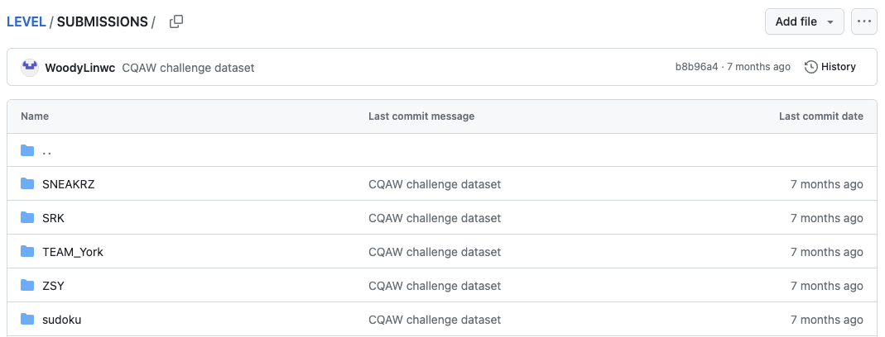

    
Submit your results:

    <ul class="info3 points">
        <li>Step 1: Fork the repository (<a target="_blank" href="https://github.com/WoodyLinwc/LEVEL">here</a>)</li>
        <li>Step 2: Add your results under the <a target="_blank" href="https://github.com/WoodyLinwc/LEVEL/tree/main/SUBMISSIONS">SUBMISSIONS</a> folder</li>
    </ul>
    
    <ul class="info3 points">
        <li>Step 3: Create Pull Request</li>
    </ul>
    

